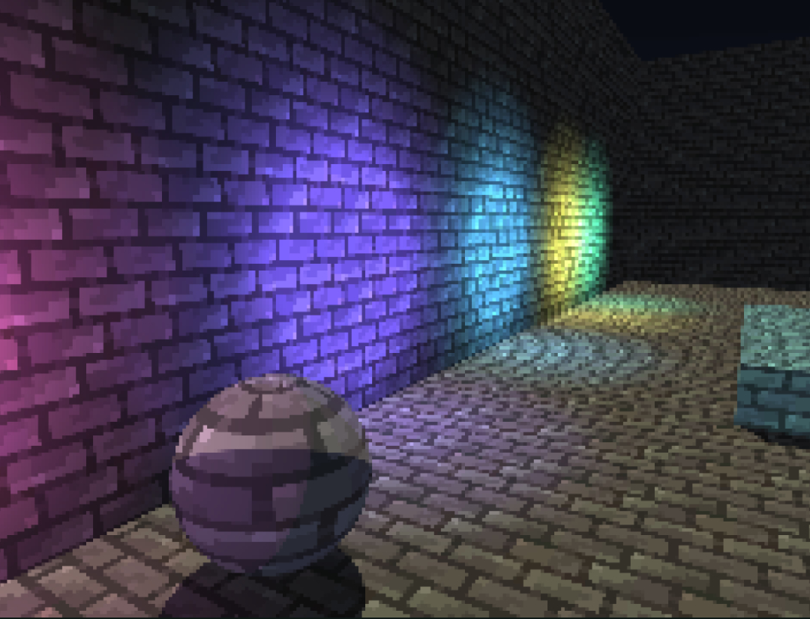

# Unity Custom Lighting

## Custom Lighting Calculation in Unity to simulate PS1 / Old PCs graphics

This is a project I made to study and develop a custom material shader for achieving that old-school PS1 look, but with some upgraded parts, for example, this shader also calculates hard shadows.



*Kinda cool, right?*

### The Camera setup

A normal camera setup is all you need if you're going just for the light rendering. No post effects needed.
> It is important to note that I haven't yet tested this with actual post effects, but they should work as normal!

However, I did downsample the actual camera rect, to get to the PS1's **internal resolution.** To achieve this, I made a very simple script that scales the camera's output resolution on `OnRenderImage()`, taking in an input `DownscaleFactor`:

```
RenderTexture scaleBuffer = RenderTexture.GetTemporary(src.width / DownscaleFactor, src.height / DownscaleFactor);
scaleBuffer.filterMode = FilterMode.Point;

Graphics.Blit(src, scaleBuffer);
Graphics.Blit(scaleBuffer, dest);

RenderTexture.ReleaseTemporary(scaleBuffer);
```

This is a super fast and efficient way to downscale any camera resolution, and the `FilterMode.Point` guarantees that the end result is "pixely" and not aliased.
